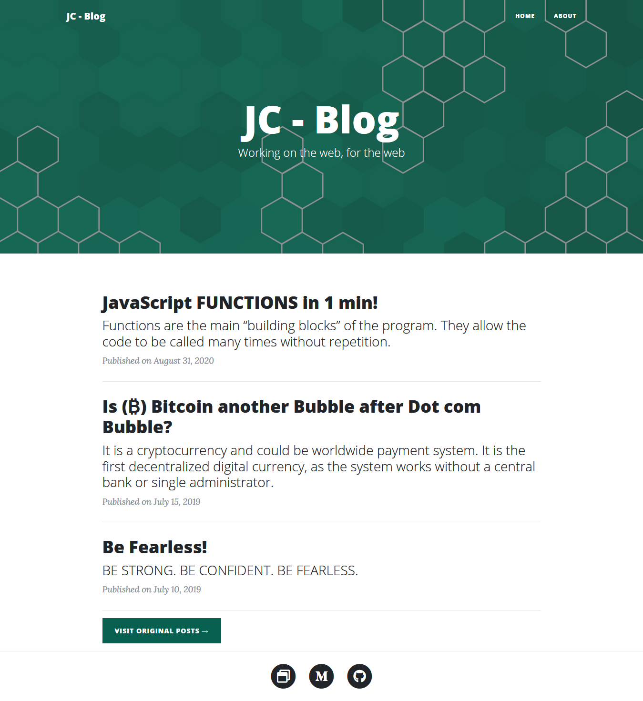

<!-- 
  Github : mrjatinchauhan
  Title  : blogs
-->

# Blogs

A blog is a discussion or informational website published on the World Wide Web consisting of discrete, often informal diary-style text entries (posts). Posts are typically displayed in reverse chronological order, where the most recent post appears first, at the top of the web page.

## [Live Preview](https://mrjatinchauhan.github.io/blogs)

## Usage

After downloading, simply edit the HTML and CSS files included here in a code editor to make beautiful changes. These are the only files you need to worry about, you can ignore everything else!

To preview the changes you make to the code, you can open the `index.html` file in your web browser. To add the Post or the Publication in main webpage, you can add `post-[numeric value]` respectively. Keep in mind to keep latest posts with bigger numeric value to its predecessors. i.e `post-2.html` is on top to `post-1.html`.
